## 基础理论
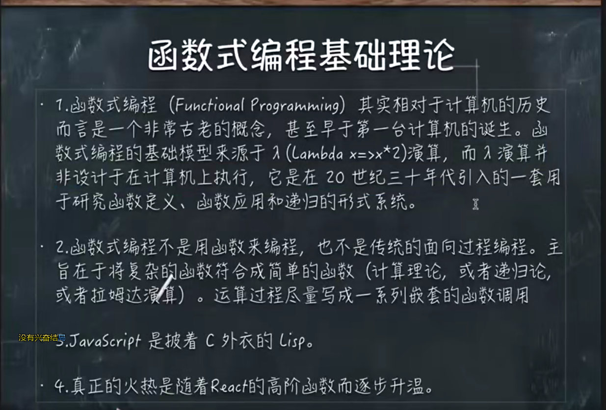
## 函数式编程特点
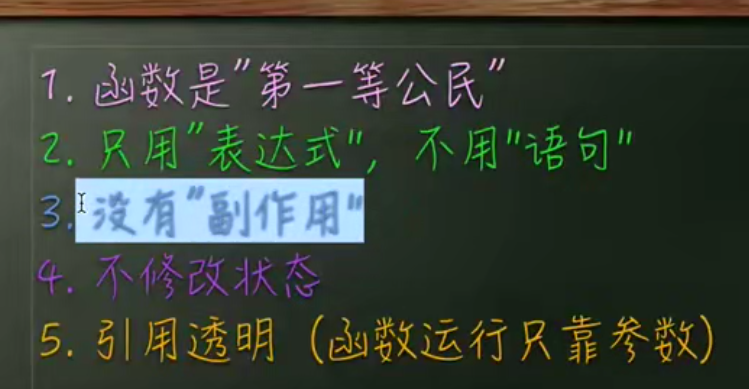
## 函数式编程常用核心概念

1. 纯函数<br/>
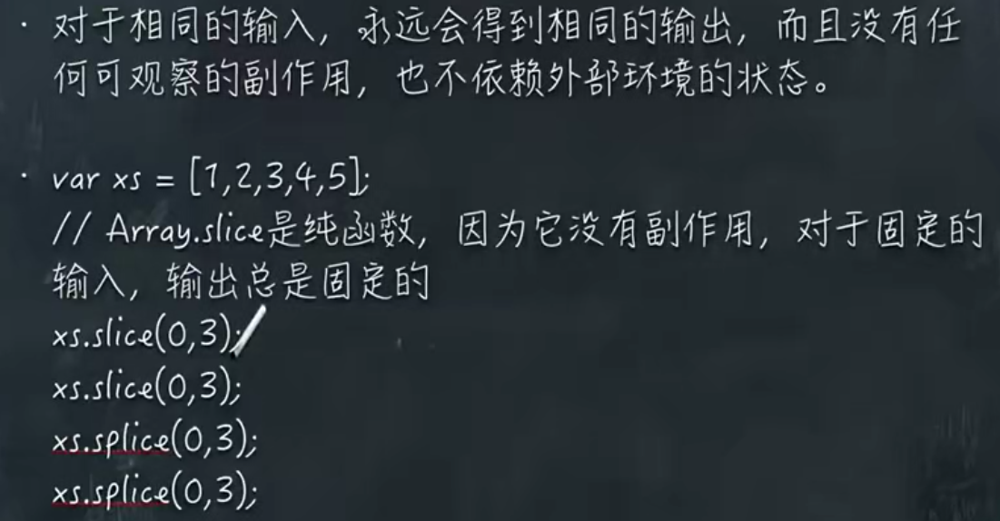
2. 函数柯理化<br/>

```
function foo (p1, p2) {
  this.val = p1 + p2;
}
// 利用bind实现foo的柯理化
var bar = foo.bind(null, "p1"); // 返回一个函数
var baz = new bar("p2");
console.log(baz.val);
```


3. 函数组合<br/>
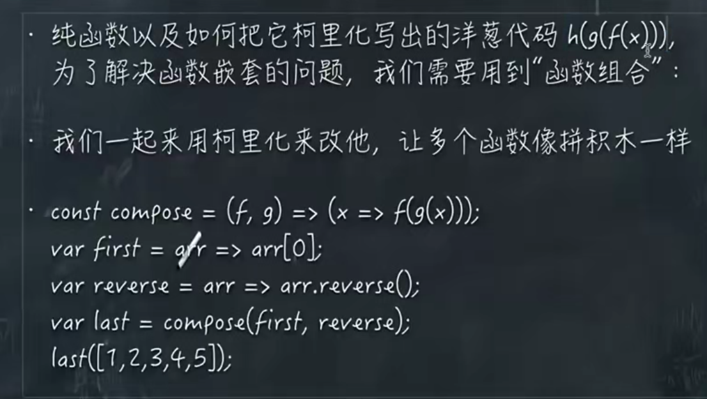

4. Point Free<br/>

5. 声明式与命令式代码<br/>

6. 惰性函数、惰性求值<br/>

```
// 第二次调用时，ajax的值已不再是函数，不需要再进行if判断
function ajax () {
  var xhr;
  if(window.XMLHttpRequest) {
    xhr = new XMLHttpRequest();
  } else {
    xhr = ActiveXObject('Microsoft.XMLHTTP');
  }
  ajax = xhr;
  return xhr;
}
```
7. 高阶函数<br/>

8. 尾调用优化<br/>

* 传统递归<br/>

* 传统递归<br/>

* 尾递归优化<br/>

8. 闭包<br/>

## 函数式编程常用核心概念-范畴与容器

1. 函子（functor）<br/>
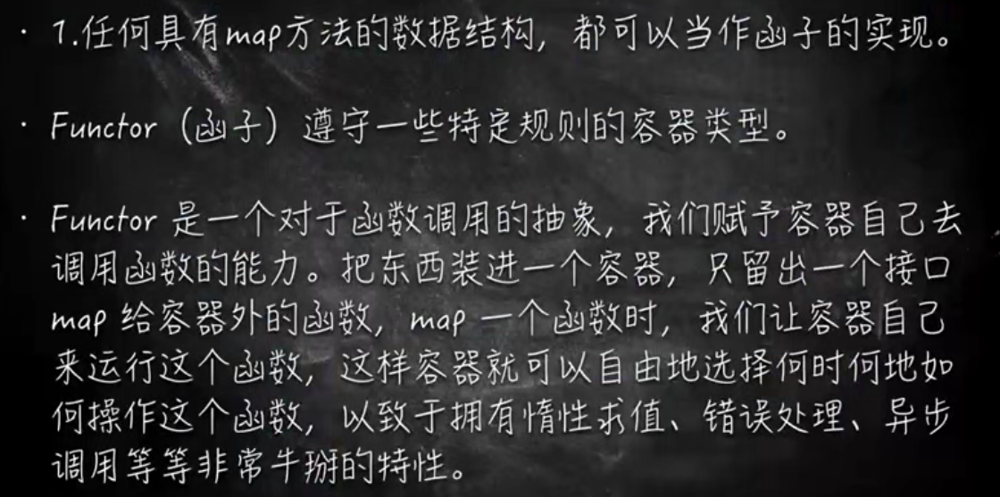
2. 容器、函子（functor）<br/>
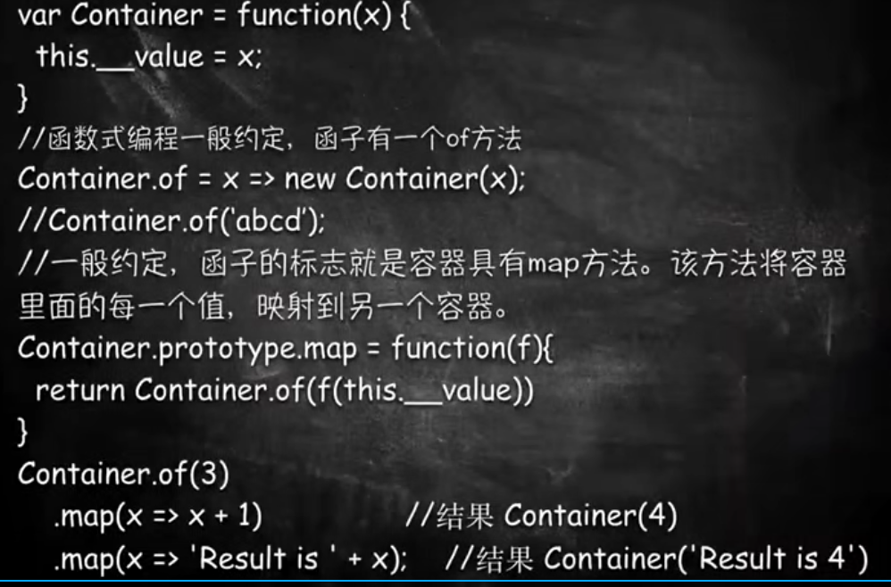
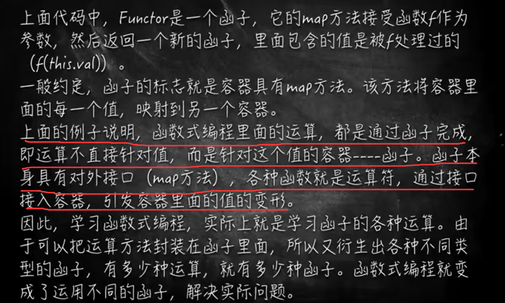
3. of方法<br/>

4. Maybe函子<br/>
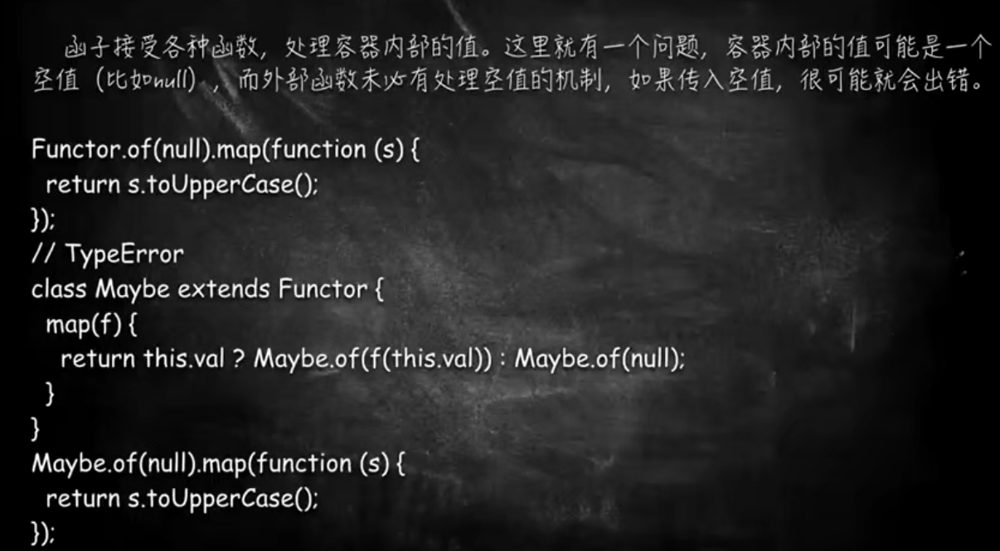
* Maybe函子实现方式如下<br/>
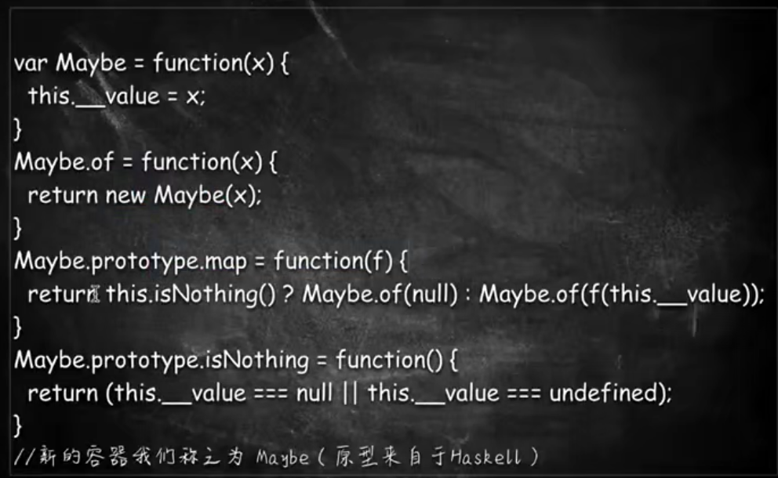
5. 错误处理Either<br/>
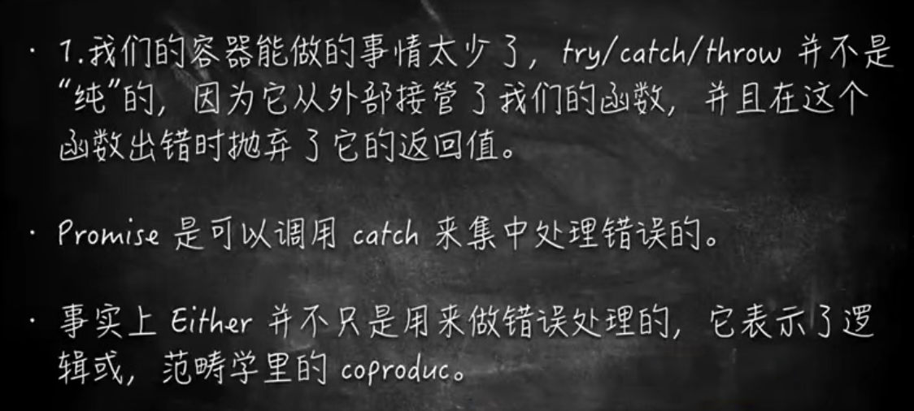
* Either函子实现方式如下<br/>
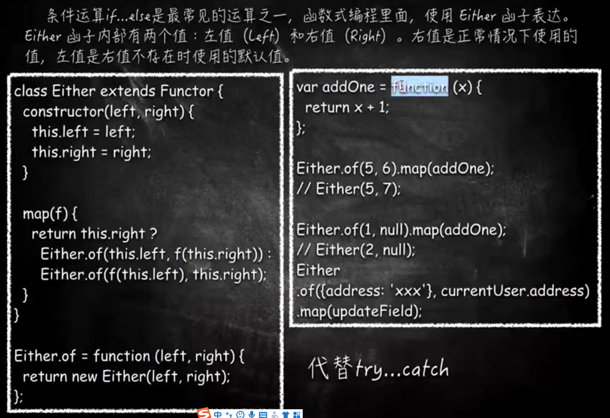

## 函数式编程常用核心概念-IO
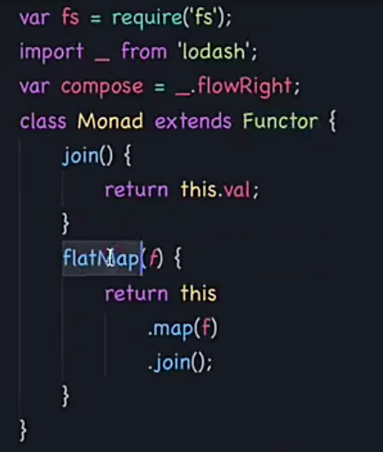
<br/>

<br/>

<br/>

```
var Container = function(x) {
  this._value = x;
}
Container.of = x => new Container(x);
Container.prototype.map = function (f) {
  return Container.of(f(this._value));
}

import 'lodash' from 'lodash';
var compose = lodash.flowRight; // 调用函数的顺序是从右往左的, 每一个连续调用，传入的参数都是前一个函数返回的结果

class Monad extends Container {
  join() {
    return this._value;
  }
  faltMap(f) {
    return this.map(f).join();
  }
}
class IO extends Monad {
  constructor(value) {
    super();
    this._value = value;
  }
  map(f) {
    return IO.of(compose(f, this._value))
  }
}

var readFile = (fileName) => {
  return new IO(() => {
    return fs.readFileSync(fileName)
  });
}

readFile('test.txt').faltMap(tail).faltMap(print); //最终转化成 compose(print, tail, readFileSync(fileName))
```
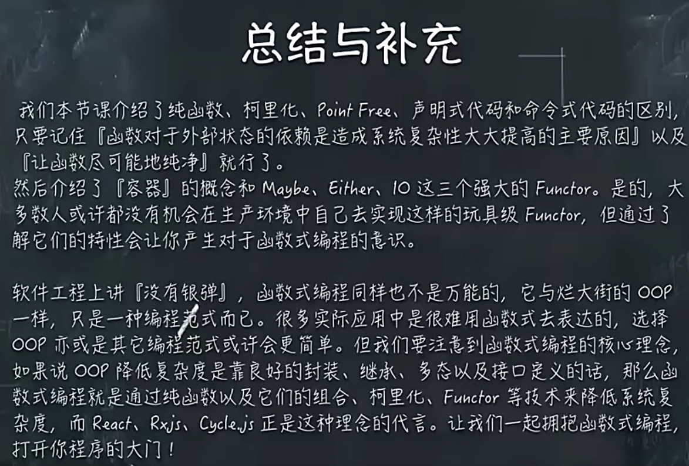


