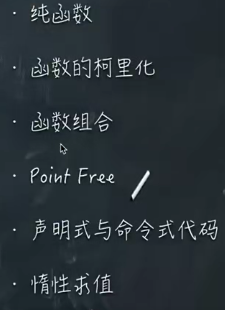
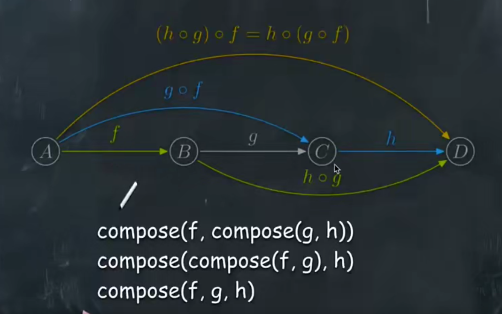
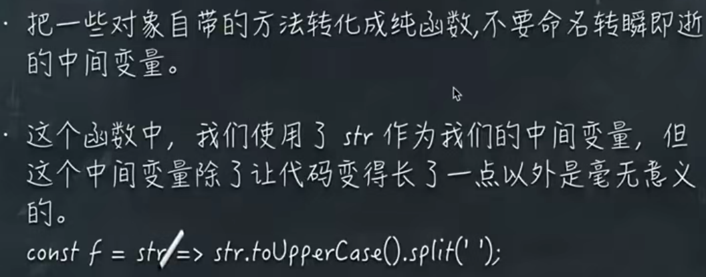
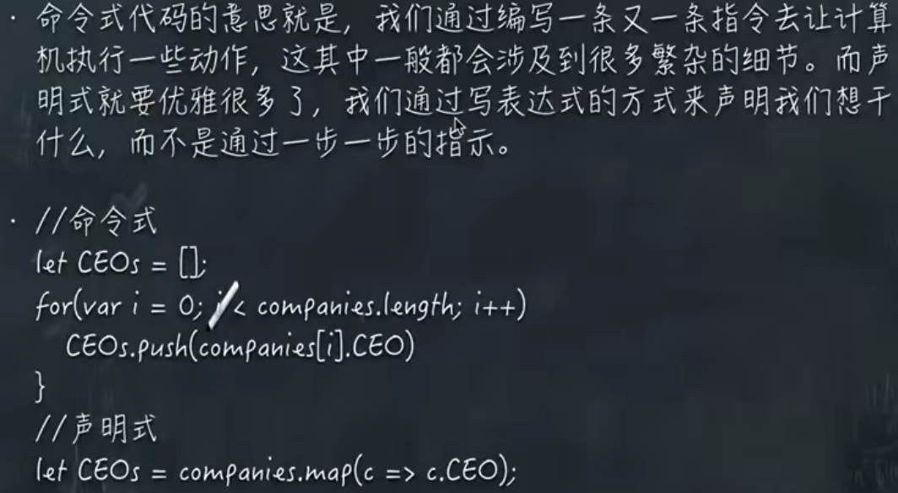
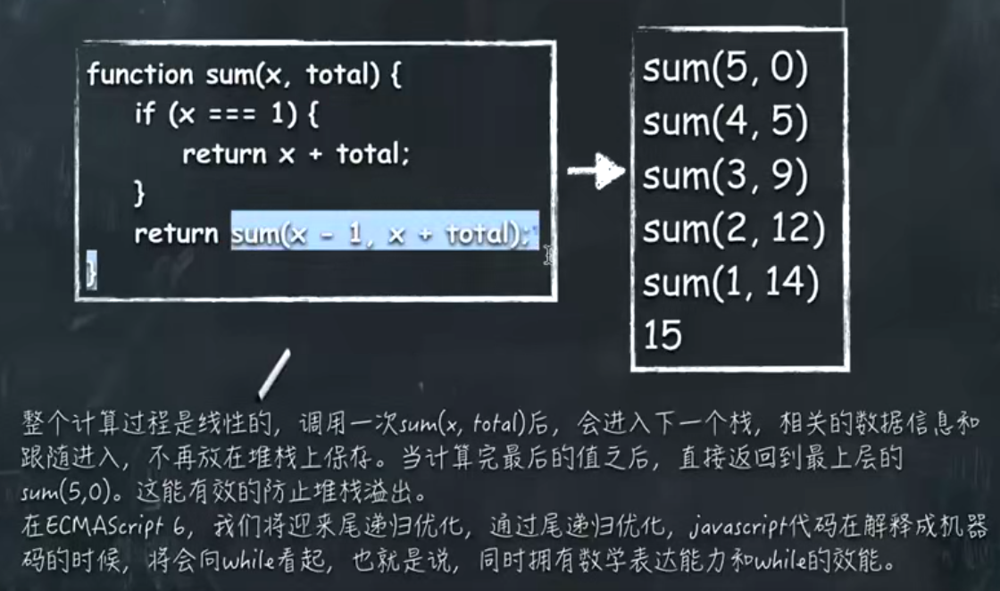
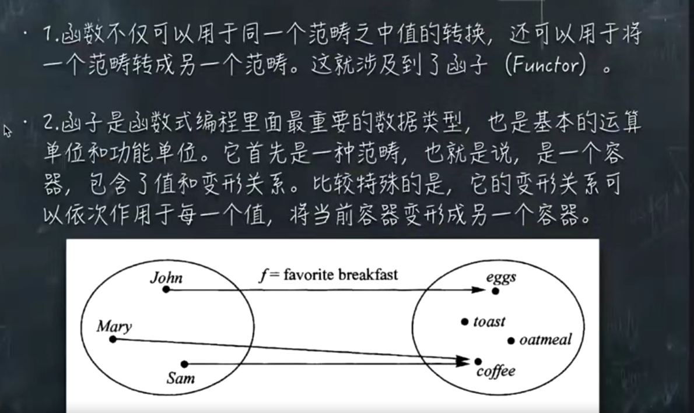
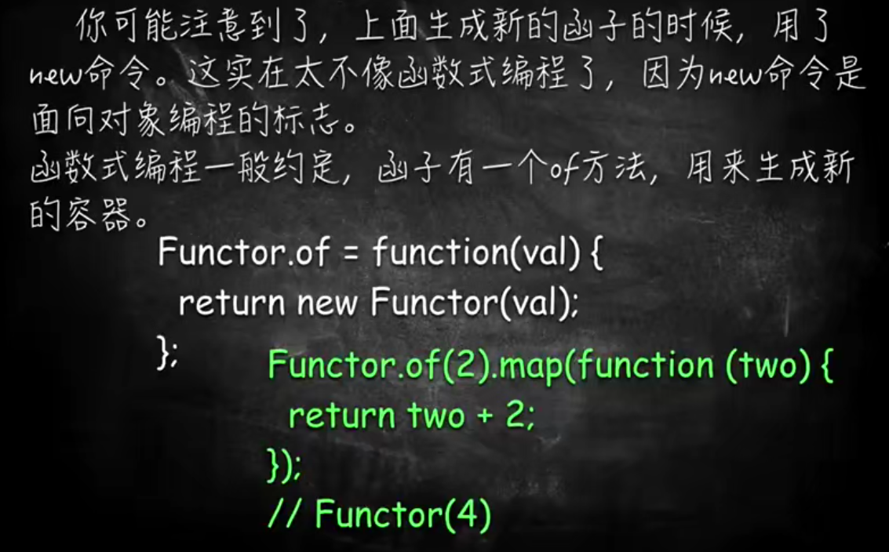
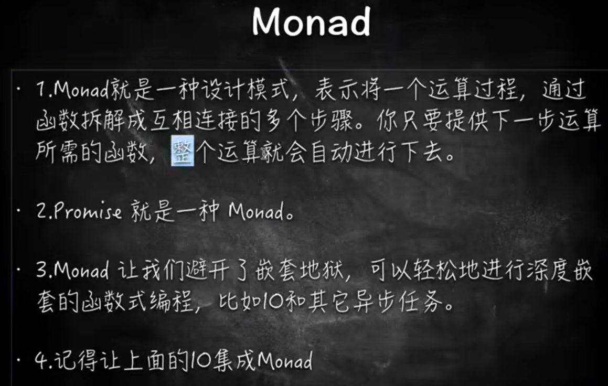
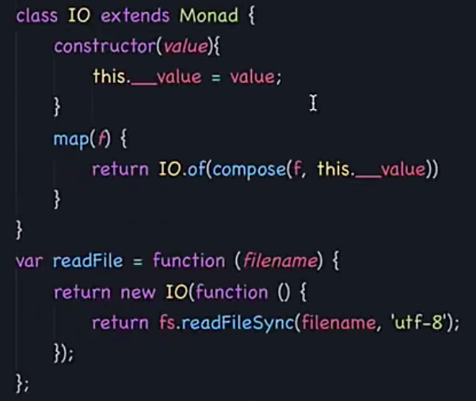

## 基础理论

## 函数式编程特点

## 函数式编程常用核心概念

1. 纯函数<br/>

2. 函数柯理化<br/>

```javascript
function foo (p1, p2) {
  this.val = p1 + p2;
}
// 利用bind实现foo的柯理化
var bar = foo.bind(null, "p1"); // 返回一个函数
var baz = new bar("p2");
console.log(baz.val);
```


3. 函数组合<br/>


4. Point Free<br/>

5. 声明式与命令式代码<br/>

6. 惰性函数、惰性求值<br/>

```javascript
// 第二次调用时，ajax的值已不再是函数，不需要再进行if判断
function ajax () {
  var xhr;
  if(window.XMLHttpRequest) {
    xhr = new XMLHttpRequest();
  } else {
    xhr = ActiveXObject('Microsoft.XMLHTTP');
  }
  ajax = xhr;
  return xhr;
}
```
7. 高阶函数<br/>

8. 尾调用优化<br/>

* 传统递归<br/>

* 尾递归优化<br/>

8. 闭包<br/>

## 函数式编程常用核心概念-范畴与容器

1. 函子（functor）<br/>

2. 容器、函子（functor）<br/>


3. of方法<br/>

4. Maybe函子<br/>

* Maybe函子实现方式如下<br/>

5. 错误处理Either<br/>

* Either函子实现方式如下<br/>


## 函数式编程常用核心函子
1. Monad函子<br/>

2. IO函子<br/>

<br/>

<br/>


3. Monad函子与IO函子的结合运用<br/>
```javascript
var fs = require('fs');
var compose = require('lodash/flowRight'); // 此函数作用见下第二段代码

class Monad {
  join() {
    return this.val();
  }
  flatMap(f) {
    // f 是一个返回IO函子的函数
    return this.map(f).join(); // 返回IO函子
  }
}
// IO函子用来包裹脏操作
class IO extends Monad {
  constructor(val) {
    super();
    this.val = val;
  }
  // val是最初的脏操作
  static of (val) {
    return new IO(val);
  }
  map(f) {
    return IO.of(compose(f, this.val))
  }
}

var readFile = function(fileName) {
  return IO.of(function() {
    return fs.readFileSync(fileName, 'utf-8')
  });
}
var print = function(x) {
  console.log('橘子')
  return IO.of(function() {
    console.log('苹果');
    return x + '函数式';
  });
}
var tail = function(x) {
  console.log(x);
  return IO.of(function() {
    console.log('苹果');
    return x + '京城一等';
  });
}

const result = readFile('user.txt')
  .flatMap(print)  // IO.of(function() { console.log('苹果'); return x + '函数式'; });
  .flatMap(tail); // IO.of(function() { console.log('苹果'); return x + '京城一等'; });
console.log(result.val());
```
* compose函数介绍<br/>
```javascript
var compose = require('lodash/flowRight');
const a1 = n => n * n;
const a2 = (a, b) => a + b;
const a3 = compose(a1, a2)
console.log(a3(1,2)) // 输出： 9
```


