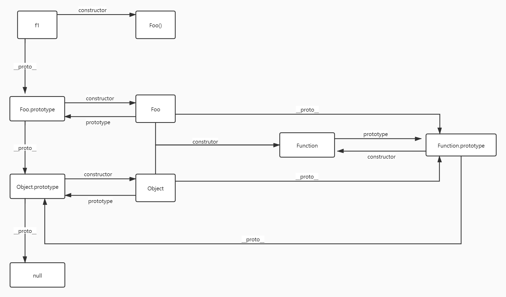

## callee/caller
## eval
```javascript
function test() {
  var a = 'hh';
  return function () {
    eval('console.log(a)') // 方式1
    window.eval('console.log(a)') // 方式2
  }
}
const tt = teset()();
// 执行结果：
// 方式1: hh
// 方式2: Uncaught ReferenceError: a is not defined

```
上述代码：<br/>
方式1: 打印test函数内部变量a，且teset()执行后，test函数内部变量a不会被销毁；<br/>
方式2: 报错，且teset()执行后，test函数内部变量a会被销毁.<br/>
## 元编程
1. symbol
2. proxy
3. Reflect

## Promise实现
1. 指定回调函数方式更加灵活；
2. 支持链式调用，解决回调地狱；
3. 如何中断Promise链式调用，返回一个pending状态的promise,`new Promise(() => {})`；
```javascript
function Promise() {
  
}
```

## 错误类型
1. Error: 所有错误类型的父类型
2. ReferenceError: 应用变量不存在
3. TypeError: 数据类型不正确的错误
4. RangeError: 数据值不在其所允许的范围内
5. SyntaxError: 语法错误

## js 原型链图
<br>
<br>