## 前端自动化测试
1. 针对新项目引入前端自动化测试，能够保证项目需求高质量的输出；
2. 前端自动化测试属于前端工程化重要的一部分，特别是在大型项目中；
3. 体量大的老项目【难以维护的项目】可以引入前端自动化测试，，保证在现有基础上维护功能的质量，而不是一定要考虑重构。

## 测试核心概念
1. 单元测试<br/>
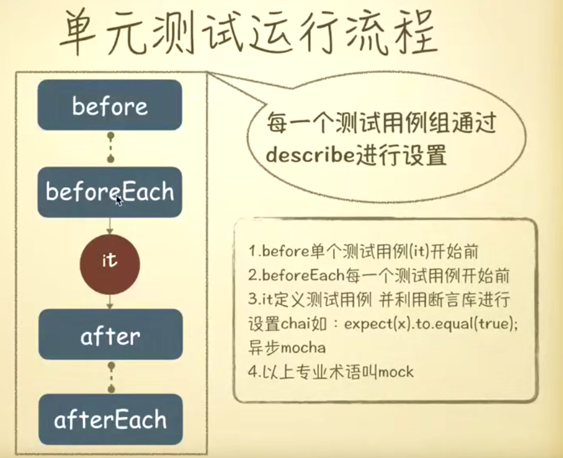<br/>
1.1 [karma](http://karma-runner.github.io/3.0/intro/installation.html)测试环境搭建<br/>
```
// 第1步
npm init

// 第2步
npm i jasmine-core karma karma-chorme-launcher karma-jasmine karma-phantomjs-launcher --save-dev

// 第3步：编写测试案例-->在项目根目录按如下路径创建文件tests/unit/index.js, tests/unit/index.spec.js
// index.js
window.add = function (a) {
  return a + 1;
}
//index.spec.js
describe("函数的基本API测试", function() {
  it("+1函数是否可用", function () {
    expect(window.add(1)).toBe(3)
  })
})
// 第4步: 初始karma，生成一个karma.conf.js
karam init 
// 第5步: 修改karma.conf.js
{
  ...
  // list of files / patterns to load in the browser
  files: [
    './tests/unit/*.js',
    './tests/unit/*.spec.js'
  ],
  ...
  singleRun: true,
  ...
}

// 当编辑一些测试用例后，第3步：运行
方式1：./node_modules/karma/bin/karma start 
方式2：karma start
```


* 利用selenium-webdriver自动化e2e测试环境搭建<br/>

```javascript
// 第1步：
npm i selenium-webdriver -D

// 第2步：下载驱动，并把驱动复制到项目根目录下
[Chrome]-->	chromedriver(.exe)
[Internet Explorer]-->	IEDriverServer.exe
[Edge]-->	MicrosoftWebDriver.msi
[Firefox]-->	geckodriver(.exe)
[Opera]-->	operadriver(.exe)
[Safari]-->	safaridriver

// 第3步：编写测试案例-->在项目根目录按如下路径创建文件tests/e2e/index.js
const {Builder, By, Key, until} = require('selenium-webdriver');

(async function example() {
  let driver = await new Builder().forBrowser('firefox').build();
  try {
    await driver.get('https://www.baidu.com/');
    await driver.findElement(By.name('wd')).sendKeys('webdriver', Key.RETURN);
    await driver.wait(until.titleIs('webdriver_百度搜索'), 1000);
  } finally {
    await driver.quit();
  }
})();

// 第4步：package.json
{
  ...
  "scripts": {
    ...
    "e2e": "node ./tests/e2e/index.js"
  },
  ...
}

// 第5步：执行测试
npm run e2e
```
*  服务端代码测试-mocha搭建<br/>
*  其他测试框架：jest,f3etest,nightwatch,rize<br/>

2. 性能测试<br/>
3. 安全测试<br/>
4. 功能测试<br/>
5. UI还原测试<br/>

## jest（v24.8.0）

1. jest demo
```
// 初始化项目
npm init

// 安装jest
npm i jest -D

```

2. jest自定义配置
```
// 在第1点创建的项目中运行命令
npx jest --init
// 选择jsdom、yes、yes

// 项目文件夹中生成一个jest.config.js
```
3. 匹配器
* 通用匹配器 ---- toBe, toEqual, toBeNull, toBeUdefined, toBeDefined, toBeTruthy, toBeFalsy
* 取反匹配器 ---- not
* Number ---- toBeGreaterThan, toBeLessThan, toBeGreaterThanOrEqual, toBeLessThanOrEqual, toBeCloseTo
* string ---- toMatch
* Array, Set ---- toContain
* 异常 --- toThrow
* 
> !(更多匹配器)[https://jestjs.io/docs/expect]

4. 异步代码测试方法
* 回调类型异步函数的测试<br/>
<br/>
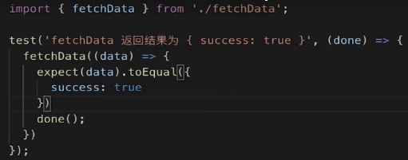
*  返回promise对象<br/>
<br/>
方式1：<br>
<br/>
方式2：toMatchObject表示当前值包含传入的值即可<br>
<br/>
方式3：<br>
<br/>
* 测试404返回<br/>
方式1：expect.assertions(1) ---- 至少执行一次expect语句<br>
<br/>
方式2：<br>
<br/>
> 上面test的回调返回对象是promise的函数都可以改为async函数，类似如下代码：<br/>
<br/>

5. jest中的钩子函数
* beforeAll ---- 测试用例执行之前调用一次；afterAll：测试用例执行完成之后调用一次<br/>
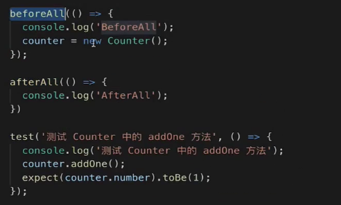<br/>
* beforeEach ---- 每个测试用例执行之前都会调用一次；afterEach：每个测试用例执行完成之后都会调用一次<br/>；
* describe --- 分组函数，将多个用例分组。<br/>
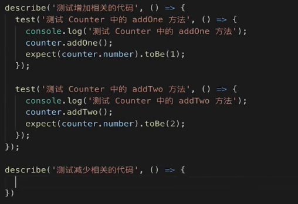<br/>

5. jest中的mock，其作用：
a. 捕获函数的调用和返回结果，以及this指向和调用顺序；
b. 可以自定义返回结果；
c. 改版函数内部的实现；
* jest.fn<br/>
<br/>
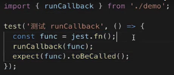<br/>
> fun.mock<br>
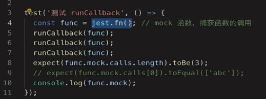<br/>
console.log(fun.mock)结果：<br>
<br/>
calls ---- 存储的是变量func每次被调用时参数<br/>
instances ---- <br/>
invocationCallOrder ---- 图片中5、6、7三个func执行顺序，这里表示他们是同步执行的<br/>
results ---- 5、6、7三个func执行后的返回值<br/>
* jest.fn自定义返回值
> 传入回调函数
<br/>
> mockReturnValueOnce --- 自定义jest.fn某一次执行后的返回值；mockReturnValue --- 自定义jest.fn执行后的返回值<br/>
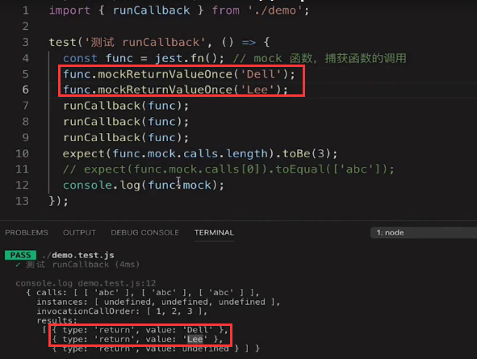<br/>
> mockImplementationOnce --- 自定义jest.mockImplementation --- 自定义jest.fn执行后的返回值<br/>
<br/>
也可以链式调用`func.mockReturnValueOnce('Dell').mockReturnValueOnce('Lee')`<br/>
<br/>
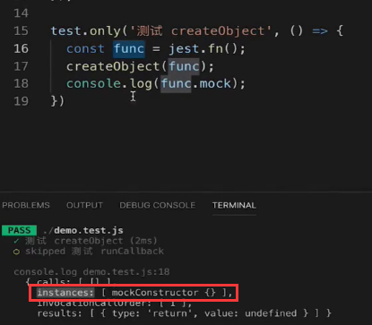<br/>
instances ---- 每次调用func执行时，this的指向<br/>
<br/>
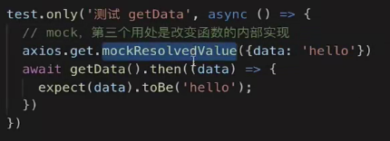<br/>
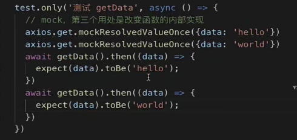<br/>

6. jest.mock方式二<br>
```javascript
// step 1 ---- 创建demo.js
import axios from 'axios';
export const fetchData = () => {
  return axios.get('/').then(res => res.data)
}


//  step 2 ---- 在根目录下创建__mocks__文件夹，并创建demo.js
export const fetchData = () => {
  return new Promise((resolve, reject) => {
    resolve('(function() { return "123"; })()');
  })
}

// step 3 ---- 创建demo.test.js
import { fetchData } from './demo';

jest.mock('./demo'); // 修改jest.config.js中automock: true,就可以不写本行自动执行jest.mock('./demo')
// jest.unmock('./demo'); // 取消mock
test('测试fetchData', async () => {
  const data = await fetchData();
  expect(eval(data)).toEqual('123'); 
})

```
* 在上述的demo.js、demo.test.js中分别添加如下代码：<br>
```javascript
// demo.js
export const getNumber = () => {
  return '234';
}

// demo.test.js
// const { getNumber } = jest.requireActual('./demo.js');
test('测试getNumber', () => {
  expect(getNumber()).toEqual('234'); 
})
```
测试`getNumber`的用例会失败，因为`__mocks__/demo.js`中不存在此方法，此时只需要在测试用例之前执行`const { getNumber } = jest.requireActual('./demo.js')`，表示直接从路径`./demo.js`获取此方法代码

7. snapshot 快照测试 --- 主要用于测试配置文件<br/>
<br/>
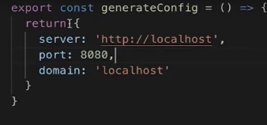<br/>
按“u”键更新所有快照<br/>
按“i”键选择性更新快照<br/>
* 自动生成行内快照<br/>
首先安装prettier`npm install prettier@1.18.2`<br/>
```javascript

// snapshot-case.test.js
export const generateConfig = () => {
  return {
    port: 8080,
    time: new Date(),
  }
}

// snapshot-case.test.js
import { generateConfig } from "./snapshot-case";

test("测试 generateConfig 函数", () => {
  expect(generateConfig()).toMatchInlineSnapshot(
    { time: expect.any(Date) },
  );
});
```
运行命令`npm run test`,结果如下：<br/>
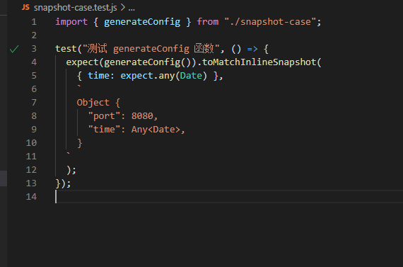<br/>

8. useFakeTimers

9. TDD(Test Driven Development) --- 测试驱动开发: red-green development开发流程<br/>
<br/>
* TDD的优势<br/>
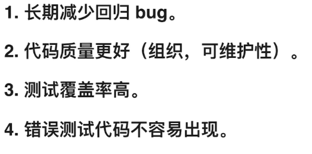<br/>

vscode中的jest插件 jest


